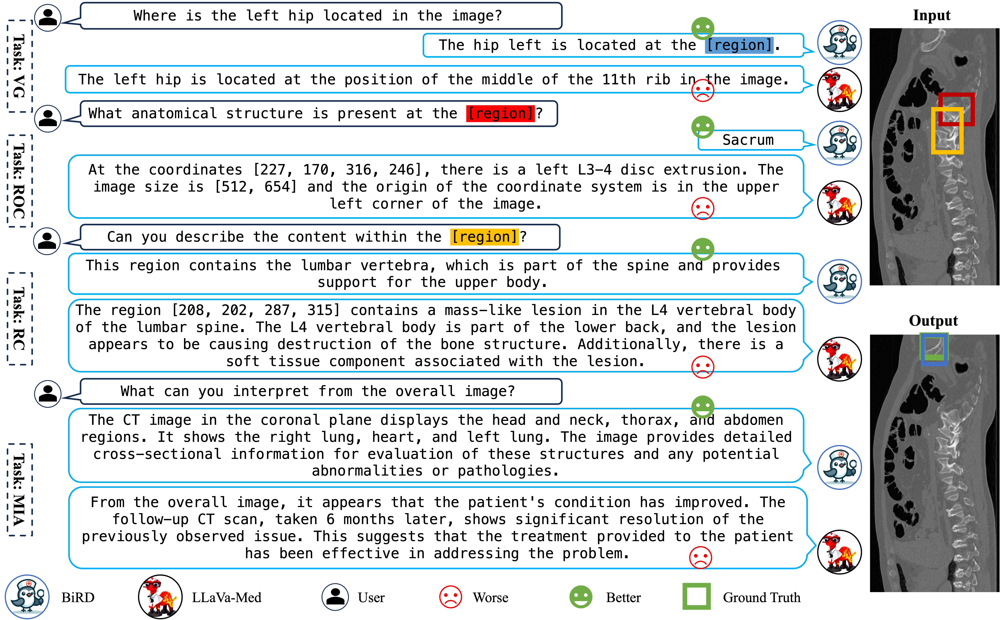

<!-- The official repository of the paper named 'A Refer-and-Ground Multimodal Large Language Model for Biomedicine' -->

#  A Refer-and-Ground Multimodal Large Language Model for Biomedicine 

<a src="https://img.shields.io/badge/cs.CV-2308.16184-b31b1b?logo=arxiv&logoColor=red" href="https://arxiv.org/abs/2406.18146"> 
</a> 

<h5 align="center"> If you like our project, please give us a star ⭐ on GitHub for latest update. 

<!-- <p align="center">
    
<p>
<h2 align="center"> <a href="">A Refer-and-Ground Multimodal Large Language Model for Biomedicine</a></h2> -->


# 😮 Hightlights

<p align="center">
    
<p>

The BiRD shows potential performance in bounding box grounding understanding in biomedical field.


- ✨ We constructe Med-GRIT-270k Dataset. Large-scale biomedical image-mask pairs are transformed into multi-modal conversations by leveraging chatGPT~\cite{OpenAI_2023} in a novel process. It is the first dataset in biomedicine to integrate referring, grounding, and conversations. 


- ✨ The first Biomedical Refer-and-grounD Multimodal Large Language Model (BiRD). It is fine-tuned by multi-task instruction learning for the biomedical domain with self-generated data. This validates the effectiveness of multi-task instruction tuning and highlights best practices for adapting the MLLMs to the specialized domain.


# 🛠️Installation

You could refer to the [official documentation of PaddleMIX](https://github.com/PaddlePaddle/PaddleMIX "PaddleMIX") to initialize the virtual environment.

# 🗃️Dataset
For the images downloading, please refer to the [SAM-Med2D](https://github.com/OpenGVLab/SAM-Med2D).

For the QA pairs, please fill the following form to get the Med-GRIT-270k dataset: [Google Form](https://docs.google.com/forms/d/e/1FAIpQLSf3G6hsFjFEGj1yzrcFu1fHhcjviEUiMsy2W45_rbP57acQqQ/viewform?usp=sf_link "Google Form"). We will send the dataset to you by email after your application is approved.


# 📀Train

We perfrom this project on [PaddleMIX](https://github.com/PaddlePaddle/PaddleMIX "PaddleMIX") framework. You can fine-tune the Qwen-VL with this command:

```Shell
sh train.sh {GPU_ids} paddlemix/config/BiRD/sft_argument_stage2.json
```

You can also refer to the [official documentation](https://github.com/PaddlePaddle/PaddleMIX "PaddleMIX") fine-tune other multimodal large model.


# 🥭 Test

### Step 1: inference

Infer to generate the prediction jsonl file.
```Shell
sh tests/models/BiRD/infer_all.sh
```


### Step 2: calculate the metrics
Use the prediction jsonl file to calculate the metrics.
```Shell
sh tests/models/BiRD/eval_all.sh
```


# 👍Acknowledgement

We thank the following excellent works: [FERRET](https://arxiv.org/abs/2310.07704), [PaddleMIX](https://github.com/PaddlePaddle/PaddleMIX "PaddleMIX"), and [SAM-Med2D](https://github.com/OpenGVLab/SAM-Med2D).


# 🪜Model Use
### Intended Use
The data, code, and model checkpoints are intended to be used solely for (I) future research on visual-language processing and (II) reproducibility of the experimental results reported in the reference paper. The data, code, and model checkpoints are not intended to be used in clinical care or for any clinical decision making purposes.
### Primary Intended Use
The primary intended use is to support AI researchers reproducing and building on top of this work. BiRD and its associated models should be helpful for exploring various biomedical pixel grunding and vision question answering (VQA) research questions.
### Out-of-Scope Use
Any deployed use case of the model --- commercial or otherwise --- is out of scope. Although we evaluated the models using a broad set of publicly-available research benchmarks, the models and evaluations are intended for research use only and not intended for deployed use cases. 


# 🔒License
* The majority of this project is released under the Apache 2.0 license as found in the [LICENSE](https://github.com/ShawnHuang497/BiRD/blob/main/LICENSE) file.
* The service is a research preview intended for non-commercial use only, subject to [Terms of Use](https://openai.com/policies/terms-of-use) of the data generated by OpenAI, and [Terms of Use](https://openxlab.org.cn/datasets/GMAI/SA-Med2D-20M) of SAM-Med2D-20M. Please contact us if you find any potential violation.


# ✏️Citation
If you find our paper and code useful in your research, please consider giving a star and citation.

```BibTeX
@inproceedings{huang2024refer,
  title={A Refer-and-Ground Multimodal Large Language Model for Biomedicine},
  author={Huang, Xiaoshuang and Huang, Haifeng and Shen, Lingdong and Yang, Yehui and Shang, Fangxin and Liu, Junwei and Liu, Jia},
  booktitle={International Conference on Medical Image Computing and Computer-Assisted Intervention},
  pages={399--409},
  year={2024},
  organization={Springer}
}

```
